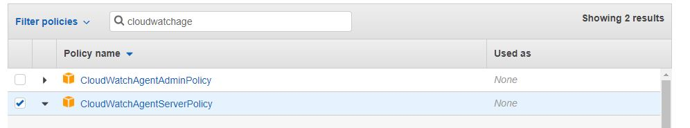

# CI/CD Project with EKS
 - 1 -  Create aws user for eks with permission;
    - 
- 1 - Create AWS EKS cluster with manifest file. See 'cluster.yaml'
    - eksctl create cluster -f cluster.yaml
- 2 - Verify cluster
    - eksctl get cluster
- 3 - Check node group status
    - eksctl get nodegroup --cluster demo-cluster
    - kubectl get nodes
- 4 - Create IAM Role to enable connection between Cloudwatch and EKS Cluster with Cloudwatch permission.
    - 

- 5 - curl -s https://raw.githubusercontent.com/aws-samples/amazon-cloudwatch-container-insights/latest/k8s-deployment-manifest-templates/deployment-mode/daemonset/container-insights-monitoring/quickstart/cwagent-fluentd-quickstart.yaml | sed "s/{{cluster_name}}/demo-cluster/;s/{{region_name}}/us-east-1/" | kubectl apply -f -
- 6 - List namespace
    - kubectl get ns
- 7 - kubectl get all -n amazon-cloudwatch
- 8 - Scale nodegroup from 3 to 4
    - eksctl.exe scale nodegroup --cluster=demo-cluster --nodes=4 --name=demo-ng
- 9 - Create "php-apache" pod
    - kubectl run php-apache --image=k8s.gcr.io/hpa-example --requests=cpu=200m --limits=cpu=500m --expose --port=80
- 10 - Verify the pod if it is running.
    - kubectl get pod
- 11 - Create "k8s-cluster-admin" IAM user with NO Permission.
- 12 - All AWS user permission stored at "kube-system" ns
- 13 - List all the configmap at "kube-system" ns
    - kubectl get configmap -n kube-system
- 14 - Export aws-auth configmap to yaml file.
    - kubectl get configmap -n kube-system aws-auth -o yaml > aws-auth-configmap.yaml
- 15 - Modify "aws-auth-configmap.yaml" file. Add "k8s-cluster-admin" userarn and username
    - 
- 16 - Apply changes on aws-auth-configmap.yaml file.
    - kubectl.exe apply -f aws-auth-configmap.yaml -n kube-system
- 17 - Verify changes on aws-aut configmap
    - kubectl describe configmap aws-auth -n kube-system
- 18 - Authenticate "k8s-cluster-admin" user
    - vim ~/.aws/credentials 
- 19 - Swicth aws user from "eks" to "k8s-cluster-admin"
    - export AWS_PROFILE="k8s-cluster-admin"
- 20 - In order to give permission to k8s-cluster-admin" user create rbac.yaml
- 21 - Create "production" namespace
    - kubectl create ns production
- 22 - Apply changes
    - kubectl.exe apply -f rbac.yaml

# Kubernetes Dashboard
- 1 - Install Kuburnetes Metric Server for AWS. Please follow the link
    - https://docs.aws.amazon.com/eks/latest/userguide/metrics-server.html
- 2 - Find right versiom of kubernetes dashboard. Follow link
    -  https://github.com/kubernetes/dashboard/releases
- 3 Create admin-service-account. see admin-service-account.yaml
    - kubectl.exe apply -f dashboard/admin-service-account.yaml
- 4 - Verify service account
    - kubectl get sa -n kube-system | grep eks-admin
- 5 - Create deployment and service for influxdb. See deploy-influxdb.yaml and serive-influxdb.yaml
- 6 - Apply changes
    - kubectl apply -f deploy-influxdb.yaml
    - kubectl apply -f service-influxdb.yaml
- 7 - Verify deployment and service for influxdb
    - kubectl get deployment -n kube-system
    - kubectl get svc -n kube-system